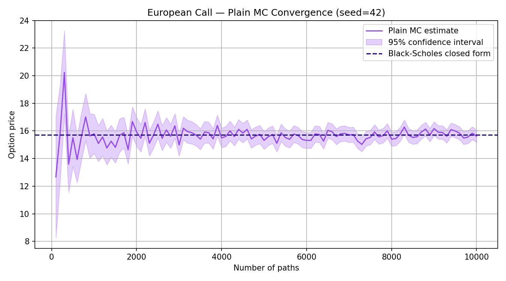
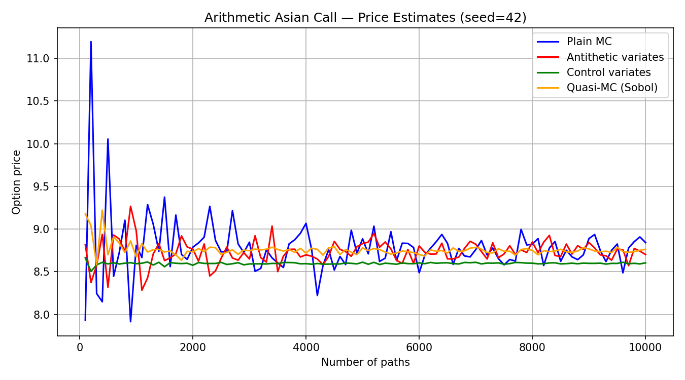
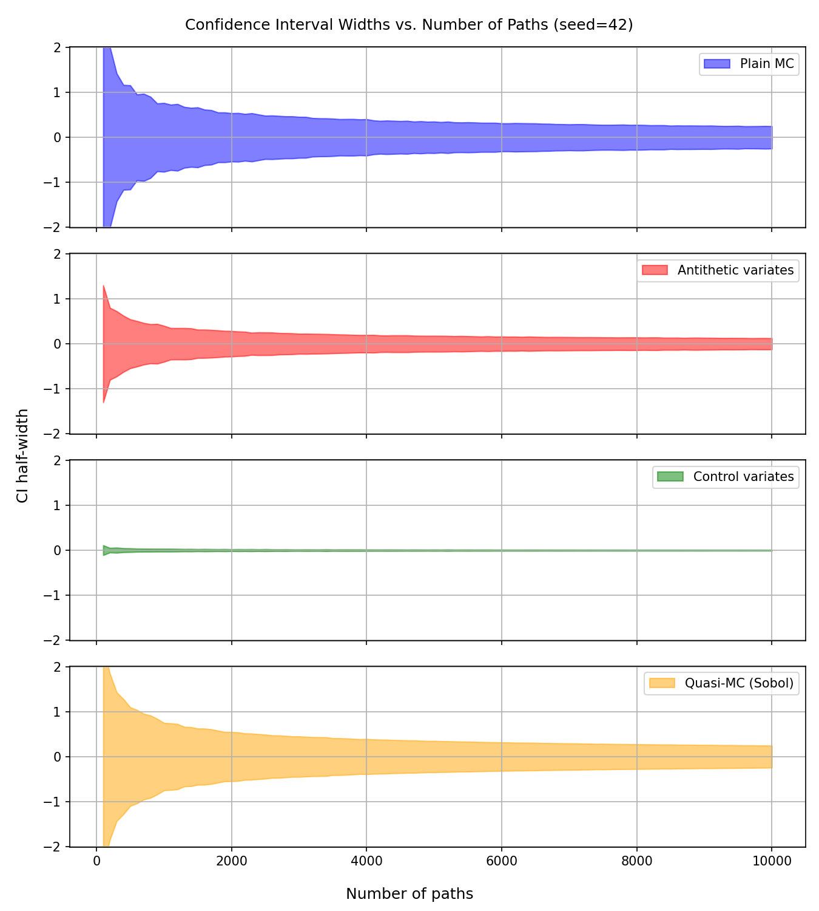
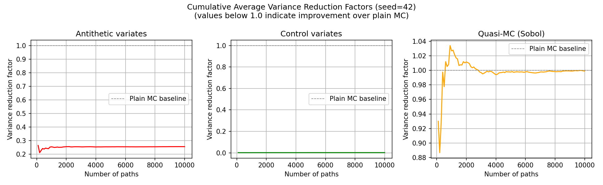
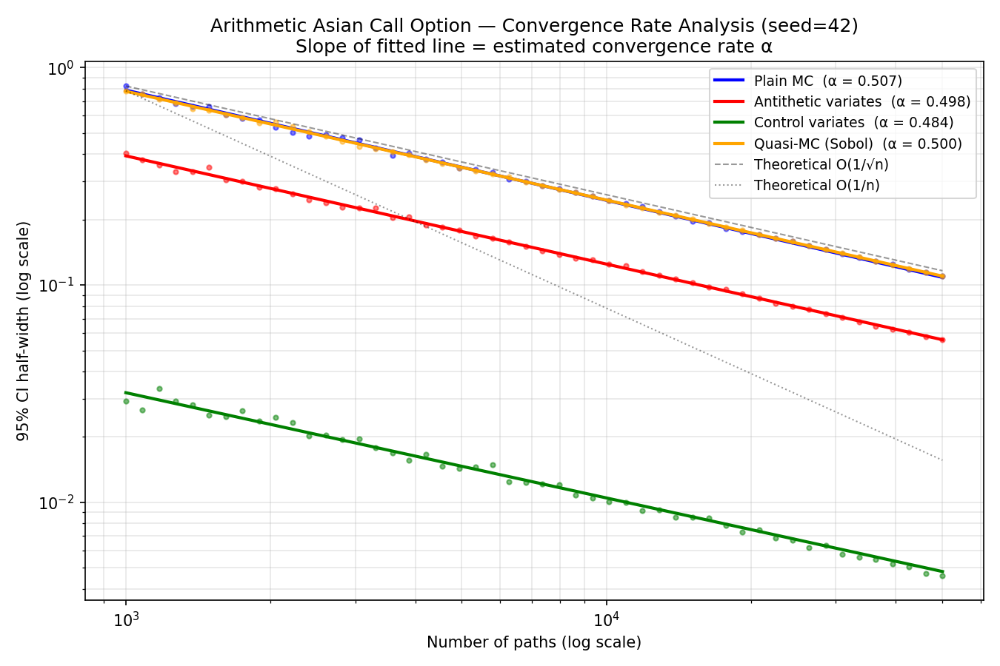
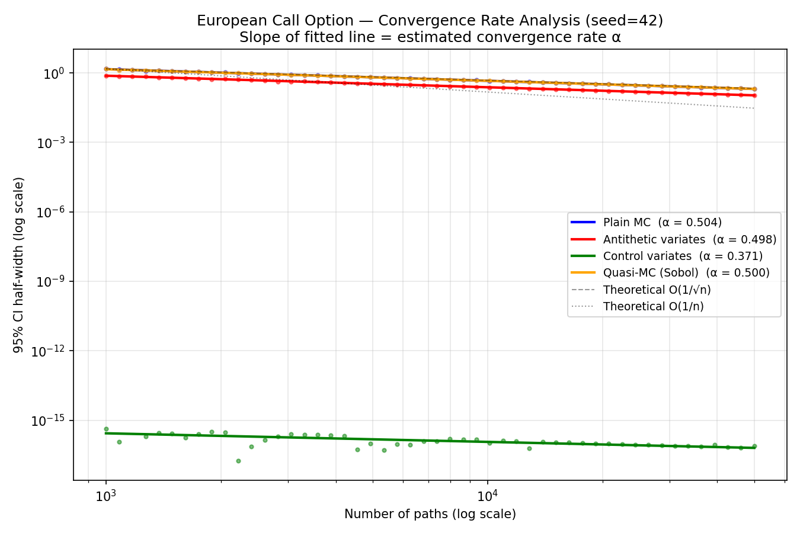

# Monte Carlo Options Pricer
This project implements a Monte Carlo simulation engine for pricing European and arithmetic Asian call options under the Black-Scholes model. It compares four estimation techniques — plain Monte Carlo, antithetic variates, control variates, and quasi-Monte Carlo (Sobol sequences) — and empirically analyses their convergence rates using fitted power laws.

## Features
- GBM price path simulator using the exact SDE solution, with optional antithetic path generation
- Payoff functions for European calls, arithmetic Asian calls, and geometric Asian calls, with closed-form solutions for European and geometric Asian calls
- Four estimators: plain MC, antithetic variates, control variates, and quasi-Monte Carlo via scrambled Sobol sequences
- Validation script comparing plain MC European call prices against the Black-Scholes closed form
- Estimator comparison script for arithmetic Asian calls, producing price, confidence interval, and variance reduction plots
- Convergence rate analysis script that fits power laws to empirical error data on both option types and produces log-log convergence plots

## Project Structure
```
├── gbm.py                    # GBM path simulator with antithetic support
├── payoffs.py                # Payoff functions and closed-form solutions
├── estimators.py             # Plain MC, antithetic, control variates, QMC
├── euro_call_plain_mc.py     # European call plain MC validation script
├── asian_arith_pricing.py    # Estimator comparison script for Asian calls
├── convergence_analysis.py   # Convergence rate fitting and analysis
├── plots/                    # Generated plots
├── requirements.txt
└── README.md
```

## Setup
```bash
python -m venv .venv
source .venv/bin/activate       # Windows: .venv\Scripts\activate
pip install -r requirements.txt
```
## Usage
```bash
# Reproduce the plots from this README
python euro_call_plain_mc.py --seed 42
python asian_arith_pricing.py --seed 42
python convergence_analysis.py --seed 42
# Custom parameters
python asian_arith_pricing.py --sigma 0.4 --K 105 --num-paths 50000 --seed 42
```
All scripts accept `--help` for a full list of options.

## Results
Throughout all experiments I used S₀ = 100, K = 100, T = 1 year with weekly time steps (n = 52), r = 0.08, and σ = 0.3.
### Validation
I first validated the plain MC implementation by running it on an increasing number of GBM paths (up to 10,000) and comparing the simulated European call price against the Black-Scholes closed form at each step. The shaded band shows the 95% confidence interval.


### Estimator Comparison — Arithmetic Asian Call
With the implementation validated, I ran all four estimators on arithmetic Asian calls, again with an increasing path count. The control variates estimator uses the geometric Asian closed-form price as the known expectation.

The control variate estimate is visibly the most stable, showing barely any noise even at low path counts. To make the variance differences explicit, I plotted the 95% confidence interval widths for each method on a shared scale.

The control variate interval (third panel) is barely visible at this scale. To quantify the improvement, I computed the ratio of each method's variance to plain MC and plotted the cumulative averages.

The antithetic variate stabilises at around 0.26 (~74% variance reduction, ~4× improvement). The control variate stabilises near zero (>99% reduction, >100× improvement). The quasi-MC factor hovers at 1.0 — no meaningful improvement over plain MC at 52 dimensions, consistent with the theoretical degradation of Sobol sequences as dimensionality increases.

### Convergence Rate Analysis
I fitted power laws of the form `error = C / n^α` to the empirical error data for both option types, using log-log plots to visualise the results. The slope α is the estimated convergence rate.
**Arithmetic Asian Call:**

**European Call:**


| Method | European α | Asian α |
|---|---|---|
| Plain MC | 0.504 | 0.507 |
| Antithetic variates | 0.498 | 0.498 |
| Control variates | — | 0.484 |
| Quasi-MC (Sobol) | 0.492 | 0.495 |

All four estimators converge at approximately α = 0.5, consistent with the theoretical O(1/√n) Monte Carlo rate. The variance reduction techniques shift the lines downward, reducing the constant C, but do not change the slope. Quasi-MC also shows α ≈ 0.5 rather than the theoretical ~1.0, confirming that the low-discrepancy advantage of Sobol sequences is lost at 52 dimensions.
